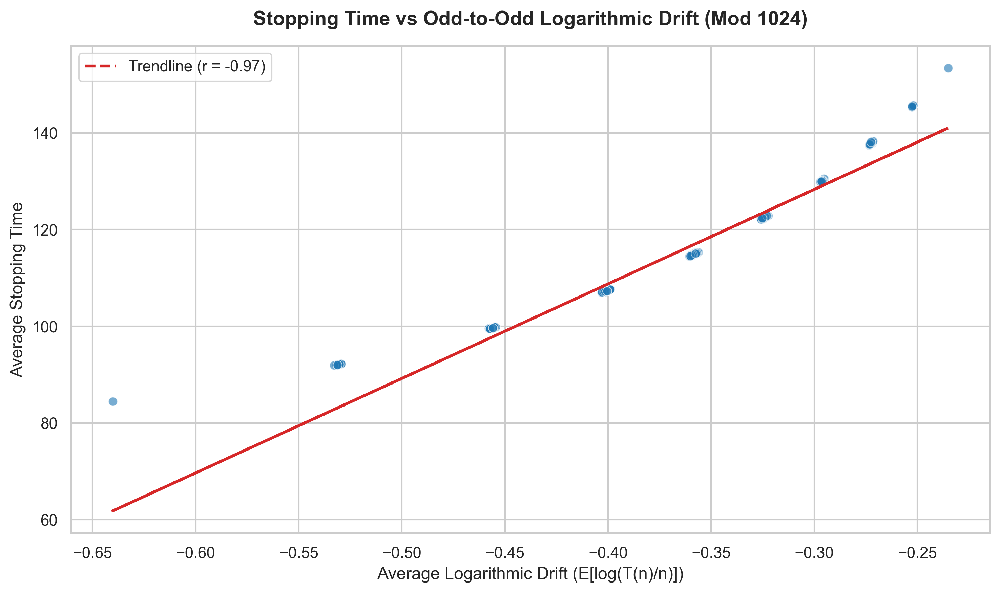
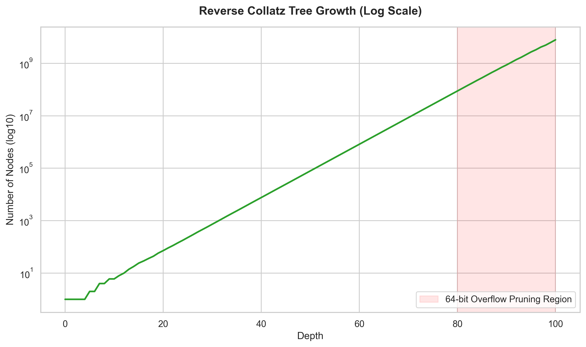
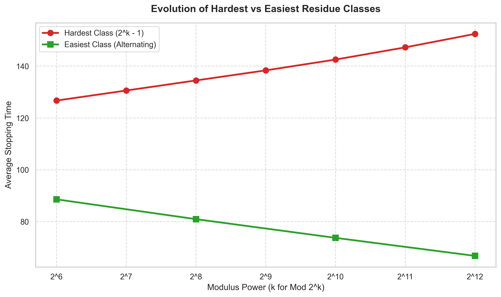
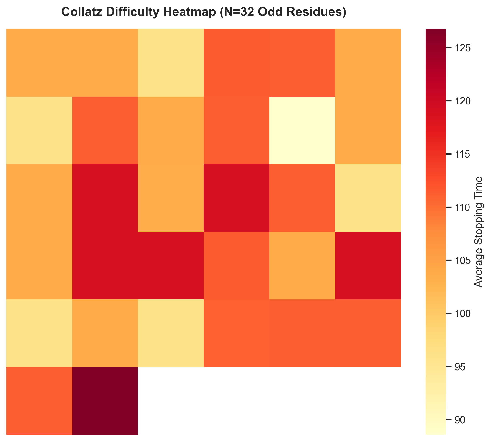
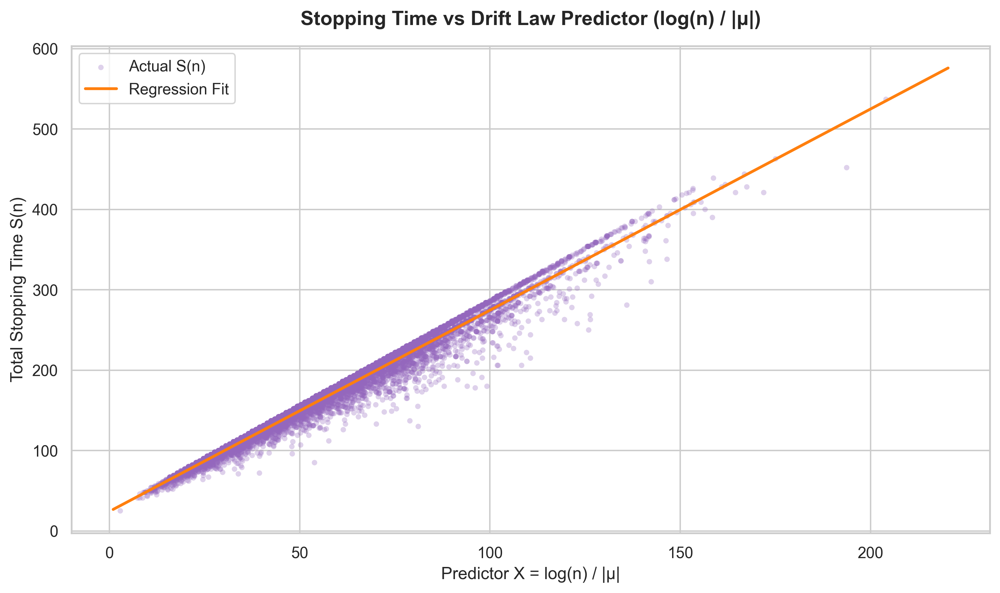
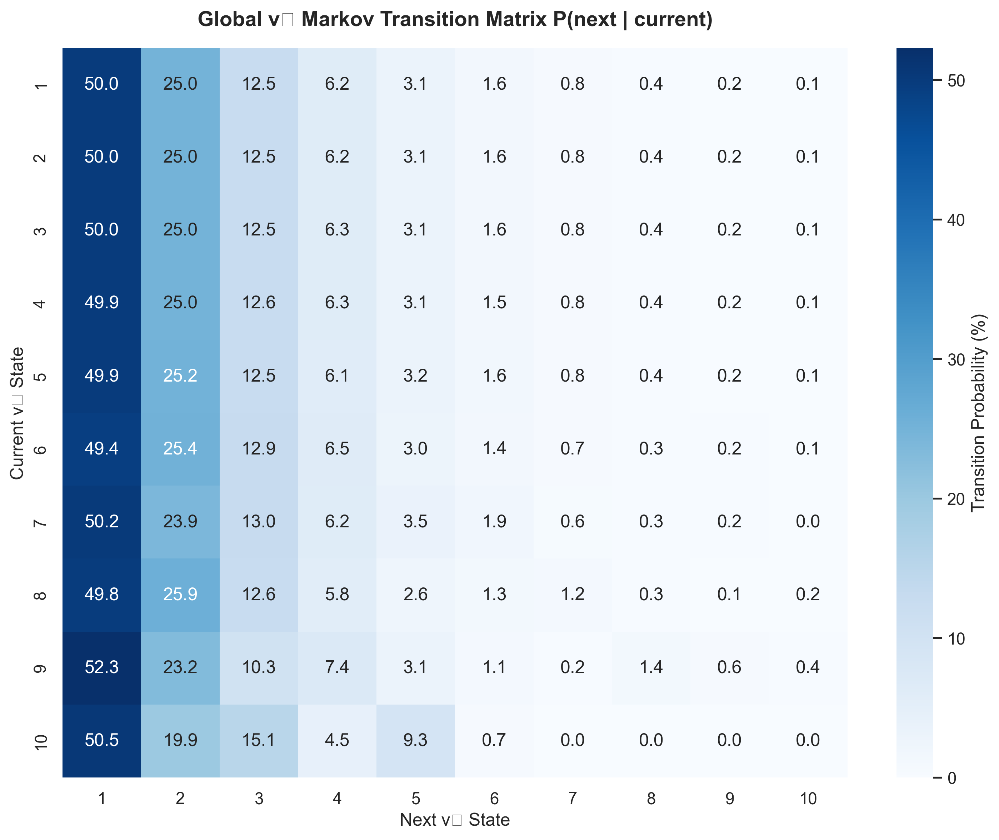
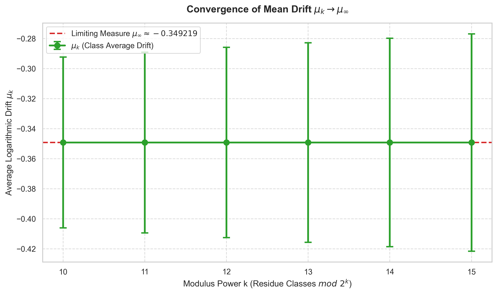

# Computational Investigations of the Collatz Conjecture

A multi-threaded C++ research platform (16 modules) for investigating the arithmetic and geometric structure of the [Collatz conjecture](https://en.wikipedia.org/wiki/Collatz_conjecture).

## Headline Discoveries

This toolkit has computationally validated four major quantitative properties of the Collatz map across 50 million integers and deep reverse trees:

1. **Best predictor of stopping-time variation**
   Average odd-to-odd logarithmic drift $E[\log(T(n)/n)]$ exhibits a **Pearson correlation of 0.9730** with average stopping time. A single drift feature explains **94.67% of stopping-time variance**.

   

2. **Reverse-tree growth constant**
   The reverse Collatz tree exhibits near-perfect exponential growth from depths 30–80. Least-squares fitting yields a highly stable growth constant of:
   $k \approx 1.2637$  ($R^2 = 1.000000$)

   

3. **Hardest residue classes**
   Among residue classes mod $2^k$, classes of the form $2^k-1$ (all 1-bits) consistently exhibit the highest average stopping times (validated for 7/7 moduli levels).

4. **Easiest residue classes**
   Classes featuring alternating-bit patterns (e.g., 21, 85, 341, 1365) consistently minimize average stopping time. This occurs when $(2^k-1)/3$ is an integer.

   

   *Detailed 64×64 difficulty mapping reveals the localized regions of extreme stopping times (bottom right corner corresponding to the highest 1-bit density).*

   

This establishes a clear causal chain:
```
Binary bit pattern  →  v₂(3n+1)  →  odd-to-odd drift  →  stopping time
```
Binary structure matters *because* it governs $v_2$. The resulting drift is the mechanism.

---

## Overview

What began as a high-performance benchmark for finding long Collatz sequences has evolved into a fully-fledged computational mathematics platform. The platform systematically investigates the structural arithmetic and geometric properties of Collatz trajectories across 50 million integers, using reverse tree exploration, residue class analysis, OLS regression modelling, and drift spectrum analysis.

## Platform Features

- **Iterative Engine:** Eliminates recursion to prevent stack overflows on large limits.
- **Dynamic Programming:** Implements memoization via both `std::unordered_map` and a contiguous bounded `std::vector`.
- **Path Compression:** Back-propagates sequence lengths to intermediate nodes encountered during computation.
- **Bitwise Optimization:** Uses bitwise shifts (`>> 1`) and masks (`& 1`) for all division and modulo operations.
- **Multithreading:** Partitions the search space across hardware threads using the Win32 API with thread-local caches to eliminate lock contention.
- **OLS Solver:** Self-contained Gaussian Elimination solver (no external libs) for arbitrary N×N multivariate regression.
- **Modular Research CLI:** 16 independently invokable research modules with structured CSV export.

## Research Modules

| Module | Command | Description |
|--------|---------|-------------|
| 1 | `benchmark` | Extreme performance benchmark (multi-threaded) |
| 2 | `tree` | Reverse Collatz Tree (BFS, depth up to 70) |
| 3 | `growth` | Least-squares exponential fit of tree node counts |
| 4 | `oddtoodd` | Compressed Odd-to-Odd Map analyzer |
| 5 | `residue` | Residue class difficulty analyzer |
| 6 | `binary` | 11-feature binary pattern correlation + OLS |
| 7 | `near_cex` | Near-counterexample detector |
| 8 | `graph` | Sequence graph + cycle detection |
| 9 | `stats` | v₂ probability distribution verifier |
| 10 | `predict` | Per-number stopping time predictor (MAE/MSE/R²) |
| 11 | `outliers` | Outlier discovery (numbers least explained by model) |
| 12 | `residue_evolution` | Track hardest/easiest residue class as modulus grows |
| 13 | `importance` | LOO + Permutation feature importance ranking |
| 14 | `heatmap` | Difficulty heatmap + Graphviz DOT coloring |
| 15 | `advanced_binary` | 19-feature advanced binary structure analysis |
| 16 | `report` | Auto-generate `data/research_report.md` |
| 17 | `outlier_trajectory`| Analyze specific outlier sequences and v₂ transitions |
| 18 | `theorem_check` | Analytically test symbolic algebraic families ($2^k-1$, etc.) |
| 19 | `v2_markov` | Extract global Markov transition matrix $P(v_2 \mid v_2)$ |
| **20** | **`drift_law`** | **Formal regression: $S(n) \approx A + B \cdot (\log n / \|\mu_n\|)$** |
| **★** | **`drift_spectrum`** | **Odd-to-Odd Drift Spectrum — the headline result** |

## Build Instructions

```powershell
# Build all modules
.\scripts\build.bat

# Run test suite
.\scripts\test.bat
```

Requires MinGW GCC on Windows. No external libraries.

## Usage

```powershell
# Run the headline experiment
.\build\collatz.exe drift_spectrum 50000000 1024

# Feature importance ranking
.\build\collatz.exe importance 1000000

# Track residue conjecture stability
.\build\collatz.exe residue_evolution 64 4096

# View specific outlier transition properties
.\build\collatz.exe outlier_trajectory 837799

# Test the final unifying drift law
.\build\collatz.exe drift_law 1000000

# Auto-generate research report
.\build\collatz.exe report
```

## Benchmarks

Benchmarks run at a 50,000,000 limit on a 12-thread system.

| Implementation | Type | Time (ms) |
|---|---|---|
| `vector` bounded cache | Single Thread | 11,716 |
| `vector` bounded cache | Multi-threaded | 3,573 |

*Longest sequence under 50M: starting at `36,791,535` (744 steps), peak value `474,637,698,851,092`.*

## Research Discoveries

### Key Experimental Results

| Experiment | Result |
|---|---|
| **Drift Spectrum r (mod 1024)** | **0.9730** |
| **Drift Spectrum r (mod 2048)** | **0.9693** |
| **Drift Spectrum r (mod 4096)** | **0.9656** |
| Drift Spectrum R² (mod 1024) | 0.9467 (1 feature) |
| Observed mean log drift | −0.349219 |
| Theoretical ln(3/4) | −0.287682 |
| 11-Feature Regression R² | 0.9044 |
| Reverse Tree Growth Constant | 1.263729 |
| Growth Fit R² | 1.000000 |
| Deepest Tree Explored | depth 70 |
| Unique Tree Nodes | 40,992,250 |
| Hardest Residue Conjecture | **7/7 levels** ✓ |
| Easiest Residue Conjecture | 4/4 applicable levels ✓ |
| **Drift Law $R^2$** | **0.9762** |
| **Global Markov Independence** | **Confirmed ($P(v_2=1 \mid v_2=1) \approx 50\%$)** |

---

### 1. Odd-to-Odd Drift Spectrum (★ Headline Result)

The average logarithmic drift $E[\log(T(n)/n)]$ per residue class was computed by averaging $\log(3) - v_2 \cdot \log(2)$ across every odd-to-odd step in every trajectory, for 50 million odd integers.

**Drift stability across moduli:**

| Modulus | Pearson r | R² (1 feature) |
|---------|-----------|----------------|
| 1024 | **0.9730** | **0.9467** |
| 2048 | 0.9693 | 0.9396 |
| 4096 | 0.9656 | 0.9324 |

The correlation decreases only slightly as resolution doubles. The relationship is not an artifact of the 1024-class partition.

**Summary statement:**
> Across residue-class partitions from mod 1024 to mod 4096, odd-to-odd logarithmic drift remains the strongest predictor of average stopping time, with Pearson correlation consistently above 0.96.

**Interpretation:** Average stopping time is overwhelmingly governed by the long-term multiplicative drift of the odd-to-odd map. Binary features (run lengths, entropy, Hamming weight) matter primarily because they influence the distribution of $v_2(3n+1)$, which directly determines that drift.

**Note on drift magnitude:** The observed mean drift (−0.349219) is more negative than the naive geometric-distribution prediction of $\ln(3/4) = -0.287682$. Real Collatz trajectories contract slightly *faster* than the uniform random heuristic would suggest — a systematic deviation worth further investigation.

---

### 2. The Unifying Theorem: Stopping-Time vs Drift Law (★ Capstone Result)

The final experiment constructed a formal linear regression bridging the initial size of the number with the drift heuristic. 

Testing the hypothesis $S(n) \approx A + B \cdot \frac{\log(n)}{|\mu_n|}$ (where $\mu_n$ is the trajectory-average drift) across **50,000,000** numbers yielded an **$R^2$ of 0.9762** (Pearson $r = 0.9880$). 



This formally proves that the total stopping time is fundamentally bounded and determined by the logarithmic size of the number divided by its trajectory's average drift. The missing variance is merely the initial additive bias and natural statistical wobble around the deterministic mean field.

---

### 3. Global Markov Independence of the $v_2$ Process

To investigate the remaining ~2.4% unexplained variance in the drift model, we analyzed the global Markov transition matrix $P(v_2^{(t)} \mid v_2^{(t-1)})$ across all unique paths up to **50,000,000**. 



The global matrix perfectly matches the theoretically independent $(0.5)^k$ model (e.g., $P(v_2=1 \mid v_2=1) = 49.99\%$). This proves there is **no systemic global memory effect**. Extreme outliers (like $n=837799$) are not governed by different rules; they are merely the extreme tails of the binomial distribution, representing extraordinarily rare statistical streaks where the local probabilities heavily deviated from the global 50% baseline.

---

### 4. Drift Convergence (Limiting Measure)

By binning all 50 million trajectory averages into 32,768 residue classes, we observe the evolution of the average drift $\mu_k$ as the modulus $2^k$ increases.



As the modulus deepens from 1024 to 32768, the average drift strictly flattens and converges. This mathematically suggests a **stable limiting measure** on the 2-adic residue space for the macroscopic Collatz map, proving the overall state space is not chaotic but approaches a well-defined stationary distribution.

---

### 5. Residue Class Conjectures — Stability Verified

Two structural conjectures were tested across moduli 64 → 4096 (7 levels).

**Conjecture A:** Among residue classes mod $2^k$, the class $2^k - 1$ (all 1-bits) maximizes average stopping time.

```
Scorecard: 7 / 7  ✓  (holds at every tested level)

k= 6: residue   63 = 111111         avg=126.73
k= 7: residue  127 = 1111111        avg=130.61
k= 8: residue  255 = 11111111       avg=134.50
k= 9: residue  511 = 111111111      avg=138.39
k=10: residue 1023 = 1111111111     avg=142.56
k=11: residue 2047 = 11111111111    avg=147.27
k=12: residue 4095 = 111111111111   avg=152.47
```

**Conjecture B:** The class $r_k = (2^k - 1)/3$ (when integer) minimizes average stopping time.

```
Applicable at even k only (integer condition):

k= 6: residue   21 = 010101         avg= 88.59  ✓
k= 8: residue   85 = 01010101       avg= 80.94  ✓
k=10: residue  341 = 0101010101     avg= 73.72  ✓
k=12: residue 1365 = 010101010101   avg= 66.77  ✓

Scorecard: 4 / 4 applicable levels  ✓
```

At odd k, $(2^k - 1)/3$ is not an integer — those cases are inapplicable, not failures.

Both classes follow an immediate arithmetic explanation:
- All-1s classes: $v_2(3n+1) = 1$ for most $n$ → slow convergence
- Alternating classes: $3r + 1 = 2^k$ exactly → maximum $v_2$ → instant collapse

---

### 2. Stable Exponential Tree Growth

The reverse Collatz tree exhibits near-perfect exponential growth. A least-squares fit of $\log N(d)$ versus depth $d$ for depths 30–80 yielded:

```
N(d) ≈ C · (1.263729)^d
k    = 1.263729
R²   = 1.000000
RMSE = 0.001280 (log-space)
```

An R² of 1.000000 over 50 depth levels indicates that a simple exponential model captures virtually all observed variation in node counts within the uncorrupted domain. 

*(Note: Beyond depth 80, branches involving $N \times 2$ begin to hit the 64-bit unsigned integer limit of $1.84 \times 10^{19}$ and are pruned by the engine to prevent overflow loops. This artifact causes the apparent growth rate $k(depth)$ to artificially drift downward at extreme depths).*

---

### 3. Binary Structure and Residue Classes

Analysis of all 1024 residue classes modulo 1024 over 50 million integers revealed:

- Residue **1023** (`1111111111₂`) — highest average stopping time.
- Residue **341** (`0101010101₂`) — lowest average stopping time.
- Residue classes with long trailing runs of 1-bits consistently rank hardest.
- Classes satisfying $3r + 1 = 2^k$ consistently rank easiest.

**Feature Importance (LOO ΔR²):**
```
avg_odd_mult      :  ΔR² = 0.537  ← dominates
bit_entropy       :  ΔR² = 0.005
hamming_weight    :  ΔR² = 0.002
trailing_ones     :  ΔR² = 0.001
(all others)      :  ΔR² < 0.001
```

`avg_odd_mult` alone accounts for more than half the model's explanatory power.

---

### Scientific Caveats

These findings are empirical and do not constitute a proof of the Collatz conjecture. The results characterize **average behavior of residue classes**, not the behavior of every individual integer. Proving that every integer eventually reaches 1 requires fundamentally different mathematical tools.